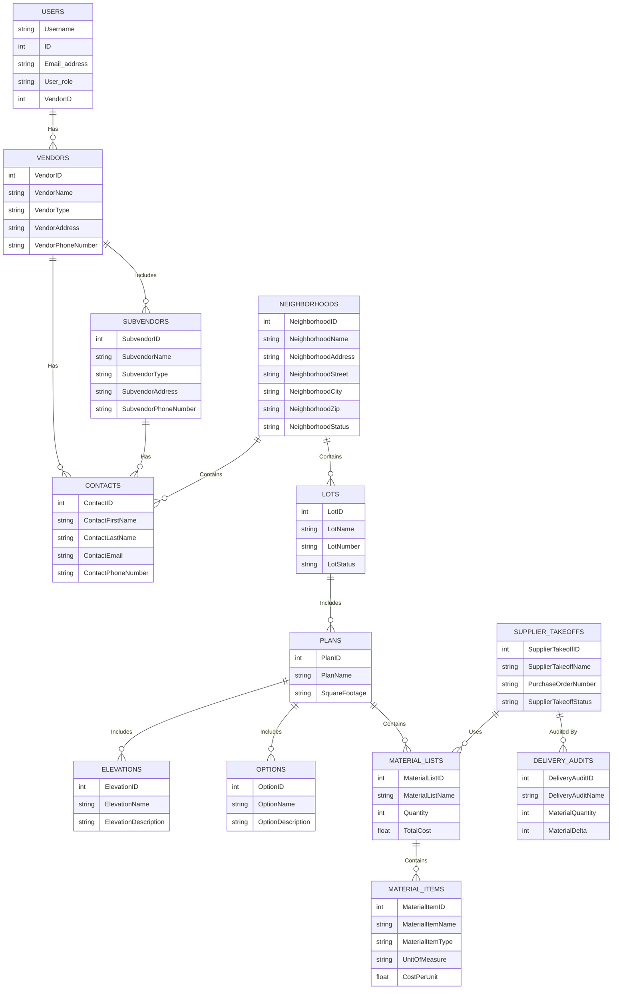

Database

```mermaid
erDiagram
    USERS {
        string Username
        int ID
        string Email_address
        string User_role
        int VendorID
    }

    VENDORS {
        int VendorID
        string VendorName
        string VendorType
        string VendorAddress
        string VendorPhoneNumber
    }

    SUBVENDORS {
        int SubvendorID
        string SubvendorName
        string SubvendorType
        string SubvendorAddress
        string SubvendorPhoneNumber
    }

    CONTACTS {
        int ContactID
        string ContactFirstName
        string ContactLastName
        string ContactEmail
        string ContactPhoneNumber
    }

    NEIGHBORHOODS {
        int NeighborhoodID
        string NeighborhoodName
        string NeighborhoodAddress
        string NeighborhoodStreet
        string NeighborhoodCity
        string NeighborhoodZip
        string NeighborhoodStatus
    }

    LOTS {
        int LotID
        string LotName
        string LotNumber
        string LotStatus
    }

    PLANS {
        int PlanID
        string PlanName
        string SquareFootage
    }

    ELEVATIONS {
        int ElevationID
        string ElevationName
        string ElevationDescription
    }

    OPTIONS {
        int OptionID
        string OptionName
        string OptionDescription
    }

    MATERIAL_LISTS {
        int MaterialListID
        string MaterialListName
        int Quantity
        float TotalCost
    }

    MATERIAL_ITEMS {
        int MaterialItemID
        string MaterialItemName
        string MaterialItemType
        string UnitOfMeasure
        float CostPerUnit
    }

    SUPPLIER_TAKEOFFS {
        int SupplierTakeoffID
        string SupplierTakeoffName
        string PurchaseOrderNumber
        string SupplierTakeoffStatus
    }

    DELIVERY_AUDITS {
        int DeliveryAuditID
        string DeliveryAuditName
        int MaterialQuantity
        int MaterialDelta
    }

    USERS ||--o{ VENDORS : "Has"
    VENDORS ||--o{ SUBVENDORS : "Includes"
    VENDORS ||--o{ CONTACTS : "Has"
    SUBVENDORS ||--o{ CONTACTS : "Has"
    NEIGHBORHOODS ||--o{ CONTACTS : "Contains"
    NEIGHBORHOODS ||--o{ LOTS : "Contains"
    LOTS ||--o{ PLANS : "Includes"
    PLANS ||--o{ ELEVATIONS : "Includes"
    PLANS ||--o{ OPTIONS : "Includes"
    PLANS ||--o{ MATERIAL_LISTS : "Contains"
    MATERIAL_LISTS ||--o{ MATERIAL_ITEMS : "Contains"
    SUPPLIER_TAKEOFFS ||--o{ MATERIAL_LISTS : "Uses"
    SUPPLIER_TAKEOFFS ||--o{ DELIVERY_AUDITS : "Audited By"
```
